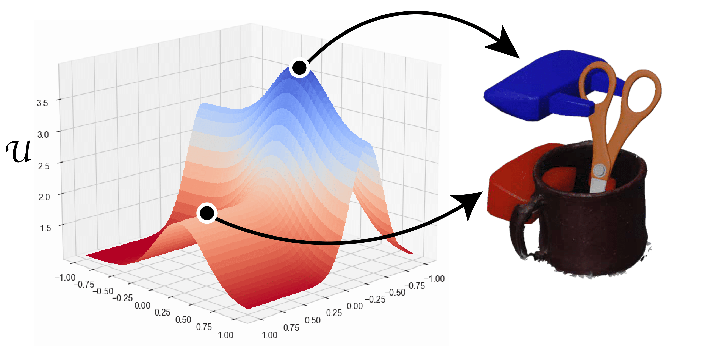

# GraspFlow

## Introduction

In this work, we propose GoES, a modular grasp optimization framework that maximizes a rank-preserving
grasp utility function. GoES takes advantage of both gradient-based optimization and gradient-free Evolution
Strategy techniques. Unlike existing works, GoES is modular and rule-based, and thus can be extended with relevant
task criteria. Experimental results in two different simulated environments show that GoES outperforms filtering
techniques and requires significantly fewer samples to obtain successful grasps.



This project has a lot of submodules. We recommend to use forked versions of submodules given in this repository. First, create and activate conda environment and install modules given in environment.yaml:

```
conda env create -f environment.yml
```

## Section 1: GraspNet from NVidia

We use Pytorch version of the Graspnet. 
### Prerequisits:
1. Pointnet2_PyTorch (given as a submodule in this repo) - PointNet++ library for GraspNet's backbone.
2. franka_analytical_ik  - solves analytical IK for Panda Robot.

### Installation
We mainly follow same installation as in. However, we also extended it to add additional filtering capabilites. Please install IK submodule and copy generated library to pytorch_6dof-graspnet module. Details are given in [this link](https://github.com/tasbolat1/franka_analytical_ik.git).

*Note:* Generally any grasp sampler can be used. In our paper, we have also tested on [GPD sampler](https://github.com/tasbolat1/gpd.git).


## Section 2: Grasp Optimization via GoES

### Prerequisites
1. franka_analytical_ik - solves analytical IK for Panda Robot.
2. differentiable-robot-model -  differentiable robot model used for E-classifier to calculate FK of the robot.
3. JointBERT - extracts intents from natural language.
4. TaskGrasp - evaluates function (intent-based) criterion on the grasps.

Each of the submodule has own documentation for the setup.
### Usage
To optimize grasps, go to GoES folder:

```
cd GoES/GoES
```

and run:
```
python refine_isaac_grasps.py --cat <cat> --idx <idx>\
            --grasp_folder ../experiments/test \
            --sampler graspnet --grasp_space SO3 --device 0 --max_iterations 30 \
            --method GraspOptES --classifier <classifier> --experiment_type E_TYPE \
            --cfg configs/graspopt_isaac_params.yaml --batch_size 15
```
For list of parameters for the above function, please check settings.txt file.

### Simulation
Please read README under ``graspflow-simulator`` folder.

## BibTeX

To cite this work, please use:

```
TODO
```
